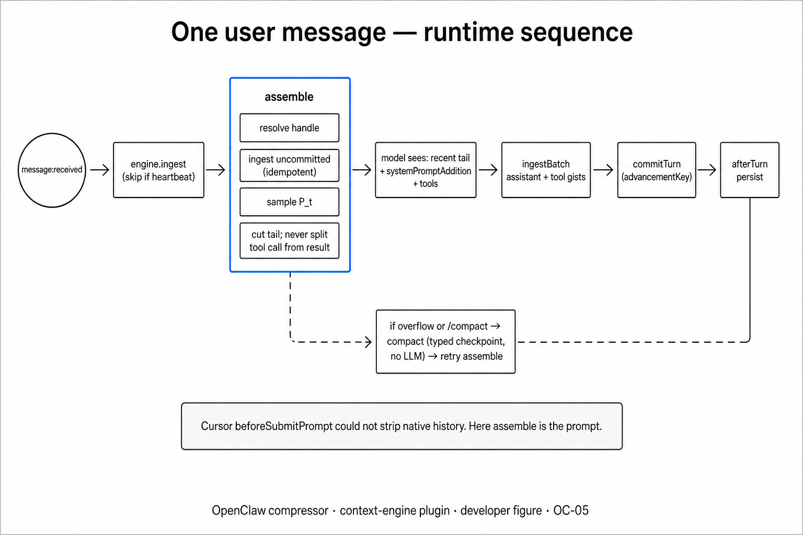

# comPREssOR (`@soltrinox/openclaw-compressor@0.1.3`)

OpenClaw **context-engine** plugin. Slot/id `compressor`. npm package **`@soltrinox/openclaw-compressor@0.1.3`** (ClawHub owner scope `soltrinox`).

## Mechanism / outcome / scope

**Mechanism:** A local symbolic graph $G_t$ plus a bounded gist matrix $C_t$. On each run, `assemble()` returns a small recent message tail (tool call/result pairs kept intact) plus a budgeted Forward Pack $P_t$ ordered HOT_SET → typed lines → ranked spans. `compact()` writes a typed checkpoint without calling an LLM.

**Outcome:** Long Gateway sessions can stay inside a token budget with labeled continuity for paths, open items, and identifiers. Uninstall restores the `legacy` slot.

**Scope:** Opt-in exclusive context engine. Not memory-core. Not RAG. Not a quality guarantee. Fail-open: hard packer failure throws so the Gateway quarantines to `legacy`. Default `engineImpl=sidecar` requires Python 3.11+; optional `engineImpl=ts` runs without Python. The model receives text only — no SQLite, safetensors, or graph JSON.

## How it works with OpenClaw

Exclusive slot `plugins.slots.contextEngine = "compressor"`. Turn path: ingest → assemble (tail + pack) → model → commitTurn; overflow or `/compact` → typed compact. Assemble throw → quarantine `legacy`. Text-only model boundary.

Details: [docs/OPENCLAW.md](docs/OPENCLAW.md).

## Dual-state (one screen)

$G_t$ (graph) + $C_t$ (matrix) → $P_t$ (Forward Pack). HOT_SET uses a 40/40/20 open-item / decision-fact / path split; under budget pressure, ranked chunks drop first.



Secondary: [fail-open quarantine](docs/figures/OC-09-fail-open.png) · [typed compact](docs/figures/OC-08-typed-compact.png) · [model boundary](docs/figures/OC-10-model-boundary.png).

## What the model sees

```text
[STATE] agent_id=claw-01 turn=42 state_id=0x9f82a1c
[HOT_SET]
* OpenItem: Resolve null pointer in JWT parse routine
* Active Topic: Authentication Middleware Migration
[TYPED]
* Fact: Server deployment target must support TLS v1.3
* Decision: Store session tokens in Redis cluster
* Path: /src/middleware/auth.ts
[RANKED]
> Turn 38 log: Redis connection pool initialized on port 6379...
> Turn 40 terminal output: test auth_test.go passed 14 checks...
```

## Install

ClawHub (preferred on Gateway hosts):

```bash
openclaw plugins install clawhub:@soltrinox/openclaw-compressor
```

Slot config (JSON5), then restart Gateway:

```json5
{
  plugins: {
    slots: { contextEngine: "compressor" },
    entries: {
      compressor: {
        enabled: true,
        config: { profile: "recall-0.5" },
      },
    },
  },
}
```

Verify:

```bash
openclaw plugins inspect compressor --runtime --json
openclaw compressor doctor
```

Local developer link (secondary):

```bash
cd OPENCLAW/COMPRESSOR
npm install && npm run build
openclaw plugins install -l .
```

Operator install detail: [docs/INSTALL.md](docs/INSTALL.md).

## Config

| Knob | Notes |
| --- | --- |
| `profile: "recall-0.5"` | Default OpenClaw retention-oriented arm (larger $K_{\max}$, HOT_SET, budget). |
| `profile: "cursor-parity"` | A/B arm aligned with IDE packer defaults. |
| `engineImpl` | `sidecar` (default, Python) or `ts` (no Python). |
| `stateDir` | Default `~/.openclaw/context-graphs`. |

Unknown keys are rejected (`additionalProperties: false`). Overlay of profile-owned knobs is allowed with a doctor warning.

## Security

In-process plugin = Gateway trust boundary. No assemble-time network. No API keys in plugin config. State is local under `stateDir`. Uninstall restores the slot to `legacy`; it does not purge graph files.

## When not to use

- Short sessions already under the context budget.
- Tasks that need exact full-file quotation (attach the file).
- Hosts without Python until you set `engineImpl=ts`.
- Operators who will not inspect `/context` when recall fails.

## vs lossless-claw

Exclusive slot: pick one context engine. This plugin uses a query-conditioned typed budgeted pack. lossless-claw uses a different policy (DAG + originals). Sharing a graph idea is not a uniqueness claim.

## Docs

- [docs/OPENCLAW.md](docs/OPENCLAW.md) — Gateway integration
- [docs/INSTALL.md](docs/INSTALL.md) — CLI / HTTP / doctor
- [docs/ARCHITECTURE.md](docs/ARCHITECTURE.md) — host callbacks and packer port
- [docs/value.md](docs/value.md) — dual-state theory
- [docs/RESEARCH.md](docs/RESEARCH.md) — measurement protocol (no product claims)

## License

MIT. See [LICENSE](LICENSE).
