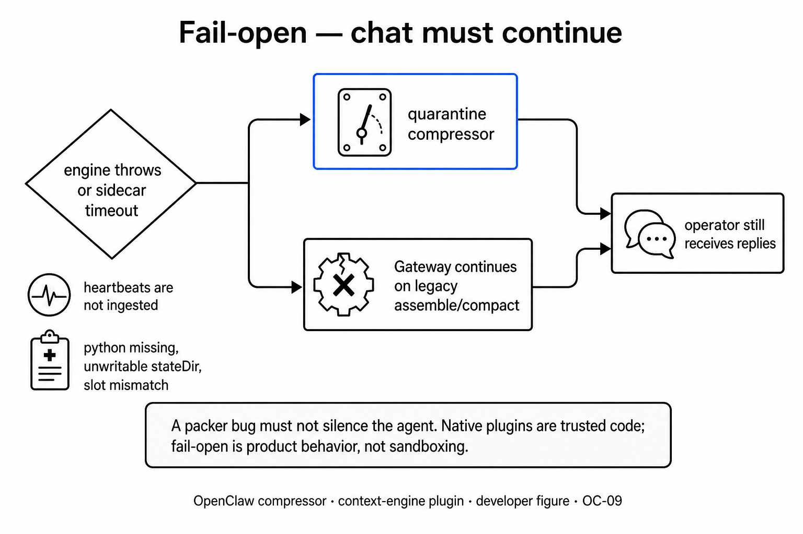
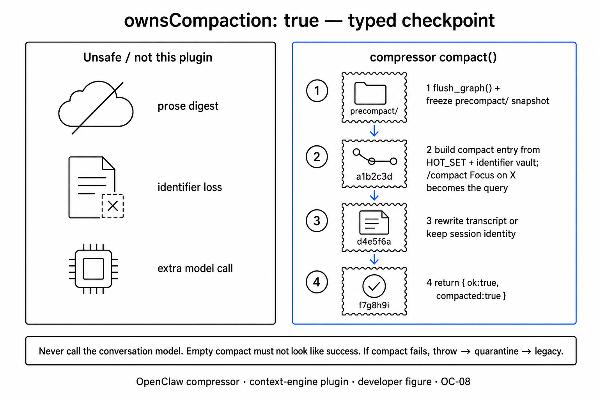
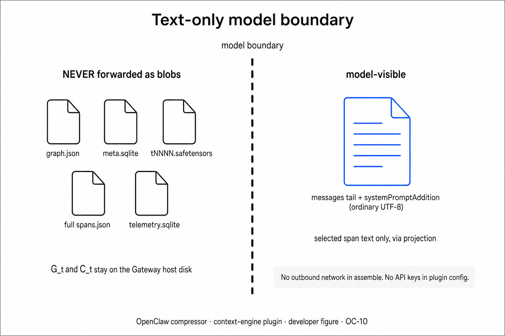

# OpenClaw Gateway integration

How **comPREssOR** (`@soltrinox/openclaw-compressor`) attaches to the exclusive context-engine slot. Packer internals: [ARCHITECTURE.md](ARCHITECTURE.md). CLI / HTTP / doctor: [INSTALL.md](INSTALL.md).

## Exclusive slot

```json5
{
  plugins: {
    slots: { contextEngine: "compressor" },
    entries: {
      compressor: { enabled: true, config: { profile: "recall-0.5" } },
    },
  },
}
```

Only one context engine is active. Setting the slot to `compressor` replaces `legacy` (or any other engine such as lossless-claw). Restart the Gateway after changing the slot.

## Host callbacks

| Callback | Role |
| --- | --- |
| `ingest` / `ingestBatch` | Step the packer on user/assistant/tool text (heartbeats skipped). |
| `assemble` | Ingest missing messages, sample $P_t$, cut recent tail under `keepRecentTokens` (tool pairs intact), return tail + `systemPromptAddition`. |
| `compact` | Flush + typed checkpoint sample. Does **not** call host `complete()` / LLM summarization. |
| `commitTurn` | Atomic-idempotent advancement fence (`advancementKey`) in `meta.sqlite`. |
| `dispose` | Tear down packer / sidecar; close SQLite. |

Runtime sequence:

```text
message → ingest → assemble (tail + pack) → model → ingestBatch → commitTurn
overflow / /compact → compact (typed; no LLM)
engine throw on assemble → Gateway quarantines → legacy
```


## Fail-open

Hard packer failure during assemble **throws**. The Gateway quarantines the engine and continues on `legacy` for the process. Empty pack text is allowed; silent full-transcript fallback is not.



## Compact

`ownsCompaction: true`. Compact writes a typed checkpoint (HOT_SET / identifier lines) without an LLM `complete()` call.



## Model boundary

The embedded runner sends ordinary text: recent tail + Forward Pack addition + tools/memory sections. Local SQLite, safetensors, and graph JSON stay on disk.



## Doctor

Gateway host `2026.7.1-2` does not expose `registerDoctorCheck`. Do not expect compressor findings under `openclaw doctor`. Use:

```bash
openclaw compressor doctor
openclaw compressor doctor --session <sanitized-id> --json
```

Exit `1` if any finding has severity `fail`; `0` when all pass/warn.

## Compat floor

| Surface | Floor |
| --- | --- |
| `package.json` `openclaw.compat.pluginApi` | `>=2026.7.1-2` |
| peerDependency `openclaw` | `>=2026.7.1-2` (optional peer) |
| `openclaw.install.minHostVersion` | `>=2026.7.1-2` |

## Related docs

- [ARCHITECTURE.md](ARCHITECTURE.md) — packer port, sidecar vs `ts`, telemetry
- [INSTALL.md](INSTALL.md) — local link, CLI, manage HTTP routes
- [value.md](value.md) — dual-state theory (measurement in [RESEARCH.md](RESEARCH.md))
